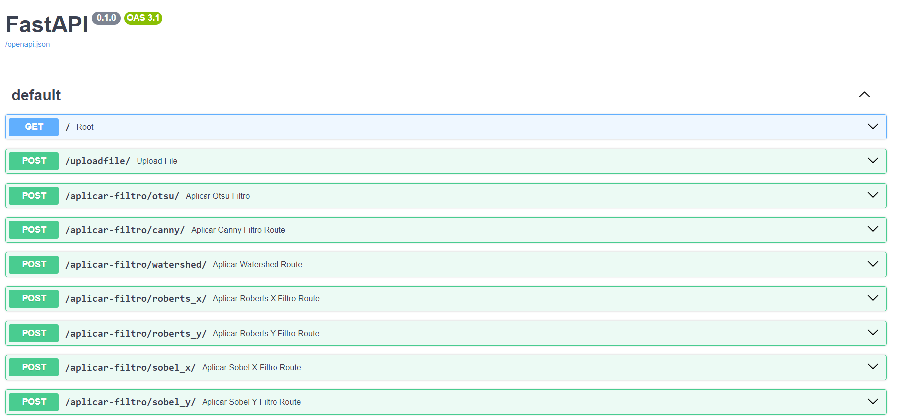

# API - Processamento Digital de Imagens
Esta API realiza alguns processamentos em imagens veja mais na documentação [documentação](https://fastapi-higorito.onrender.com/docs#/).
Desenvolvi para a disciplina de processamento digital de imagens e foi de grande aprendizagem, foi feita com FASTAPI e Python, primeiramente hospedei no vercel. Mas como nãoi sei muito bem de deploy ocorreu alguns bugs e decidi hospedar no onrender.

## É DE SUMA IMPORTÂNCIA AGUARDAR UM POUCO A API INICIAR DEVIDO AO LOCAL QUE ELA ESTÁ HOSPEDADA

## Utilização 
header
```
Accept - application/json
Content-Type - multipart/form-data
```
body
```
file - <qualquer-imagem.png/jpg/jpeg>
```

## Documentação


 
